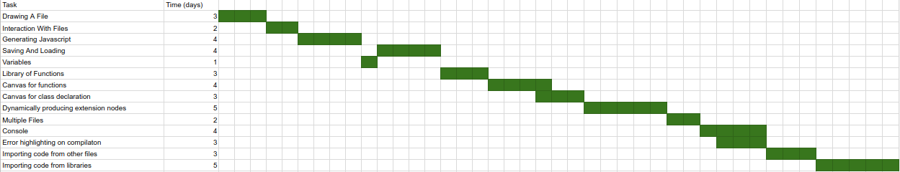

# 4.0 Software Development Plan

## 4.1 Introduction

This Software Development Plan provides the details of the planned development for the Visual-JS CSCI, which is an application allowing the user to create code visually via connecting nodes.

This project's goal is to allow new and experienced programmers to develop javascript code in a visual manner, that rivals its textual counterpart in speed of production and breadth of capabilities.

In the first month we will have the ability to fully create a single page of JavaScript via nodes. These nodes will be draggable, and the camera will be able to zoom and pan.

In the second month we will have multiple files, the ability to create variables, and a large amount of node types, including but not limited to: function call, object access, for loop, variable set, variable get, and construct object.

In the third month the ability to import and export code from other vjs files will be implemented. Additionally the ability to highlight multiple nodes to either move or delete them as a group will be added. Undo and redo buttons will be functional. The ability to load in outside javascript in order to use libraries will be added.

In the fourth month no new features will be added other than compilation error handling. The user interface will be made more friendly to beginners of the application. Additionally, output and error handling will be done on the application for the viewer to see.

## 4.2 Project Resources

Ryan Taus will be completing every deliverable in this project.

### 4.2.1 Hardware Resources

#### 4.2.1.1 Development Resouces

In developing the application I used a machine with:
  * 8 GB RAM
  * 64 bit Windows 10 OS
  * i7 processor
Additionally, testing was done on an ubuntu system for cross OS compatibility checking.

#### 4.2.1.2 Release Resources

No specific hardware needed for the release, other than a computer that is capable of running a chromium browser.

### 4.2.2 Software Resources

* Atom
* ESLint 4.13.1
* Electron 1.7.11
* Node 6.9.5
* d3.js 4.12.0
* mocha 5.0.0

## 4.3 Project Organization

The work is split up into 3 main sections.

Model: The elements of the project that directly translate into the javascript. The model is described and fed into the view team.

View: The view section handles the data taken in from the model and produces the application the user interacts with.

Test/QA: Test and QA handle the writing of test cases based on the description of the functions written by the other teams. Additionally, they observe the app in a working state and pass over any bugs to the other teams.

## 4.4 Schedule

This section provides the detailed schedule for the visual-js project.

### 4.4.1 Gantt Chart

### 4.4.2 Resource Table

Task | Resource

 '*' |   Ryan
