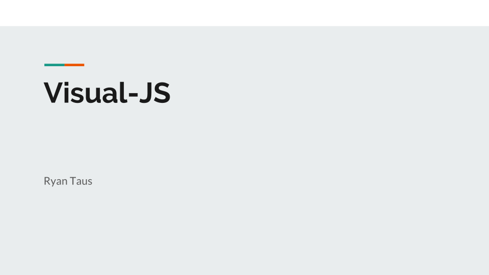
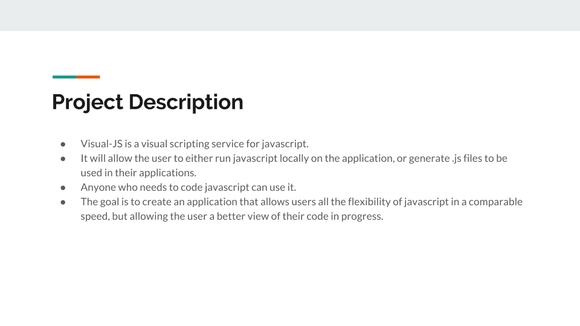
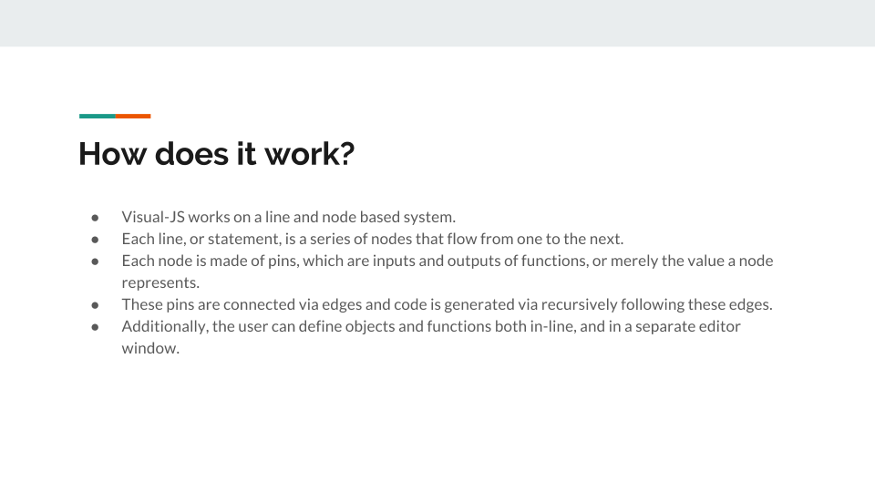
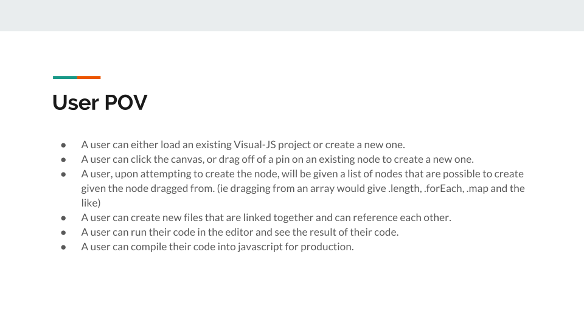
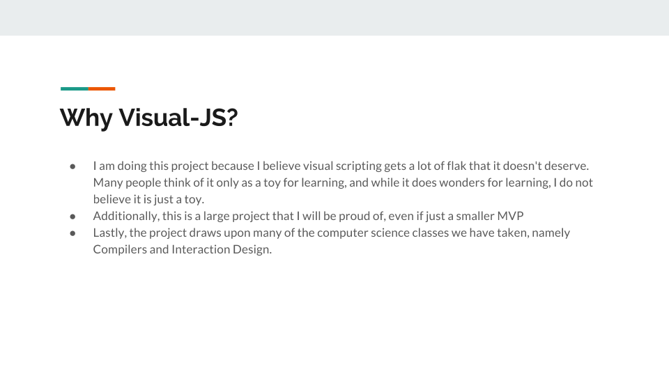

Project Proposal Document

3.1 Proposal

3.1.1 Description

Visual-JS is a visual scripting engine for creating Javascript. With it, users will be able to create and organize multiple Javascript files in a project. The project works on a node based system. For example, a node could be a function with 2 inputs and 1 output. These would be represented with pins that can connect to the input or output of another node. By linking these together the user can create any Javascript program they could by merely typing. Additionally, Visual-JS allows the user to easily create classes as there is a separate editor window just for creating them. Ideally, the project would allow plugins and Github integration, but I will not be pursuing these for the semester. This project allows users to see their code as they create it, and I will be focusing on making it as usable and as fast to use as possible, because often those are complaints about visual scripting services.

3.1.2 Justification

Visual-JS definitely implements what I have learned in my classes throughout my years at LMU. While Compilers and Interaction design are clearly the most important, as I am effectively making a compiler that people interact with in a direct manipulation style, there are other classes that affect the project such as Data Structures and Algorithms. It allows me to delve further into what makes an interface usable, and how to create a working compiler and application. Creating this project provides numerous challenges, namely allowing a user to write working Javascript code with a tree that describes the statements and expressions. This project is admittedly a very large one for the semester, however I am confident in my ability to get out at least a solid minimum viable product by the end of the semester. I have created both a compiler for a language and many web apps so I have already cultivated the skills necessary for completing the project. This project should be very interesting, as visual scripting is a facet of programming I believe is very underestimated. To be able to visually see the flow and format in your code is a great boon, and it allows an easier learning curve as the programmer can see their options and data types with complete ease. One issue many people have with visual scripting is that it does not allow all the features of the language, and that is an issue I hope to combat.

3.2 Presentation

